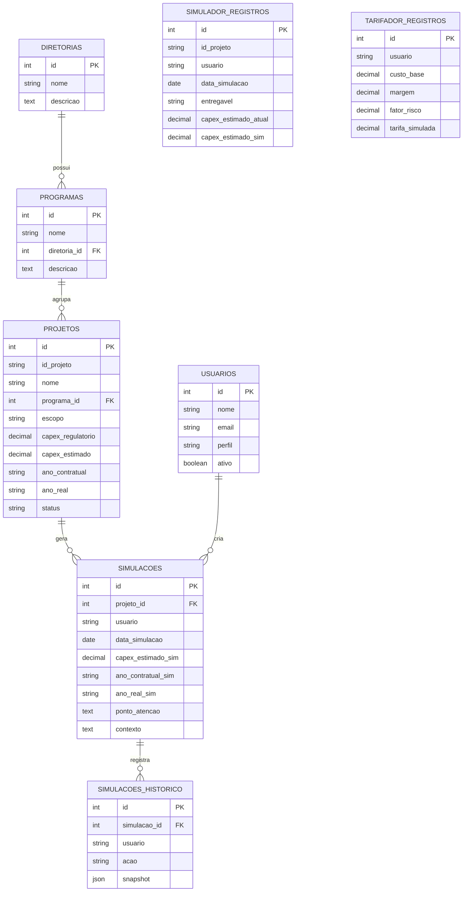

# 🏗️ Portal de Planejamento de Obras

Plataforma integrada para precificação de atividades, planejamento de obras e simulação de cenários. Permite análise de custos, cronogramas, multas, outorgas e impactos operacionais, apoiando a tomada de decisão em projetos de infraestrutura. Este backend em Node.js/TypeScript substitui as rotinas antes executadas por PowerApps/Power Automate.

## 🎯 Objetivos

1. Consolidar em uma única plataforma web os dados de planejamento antes espalhados entre PowerApps, Power Automate e SharePoint.
2. Permitir a simulação de cenários (custo, prazo, risco, outorga e multa) sem alterar a base oficial de projetos.
3. Fornecer relatórios, gráficos e importação/exportação de planilhas Excel para apoiar decisões de engenharia e planejamento.

## 📁 Estrutura do Projeto

```
PortalDePlanejamentoDeObras/
├── database/            # Schema SQL e massa de dados de demonstração
│   ├── schema.sql
│   └── seed_demo.sql
├── docs/                 # Documentação funcional e de migração
│   ├── migracao-powerapps-portal.md
│   └── processo-mvp-portal.md
├── public/               # Frontend estático (portal, simulador, tarifador)
│   ├── index.html
│   ├── simulador.html / simulador.js / simulador.css
│   ├── tarifador.html
│   └── theme.js
├── src/                  # Código-fonte da API
│   ├── server.ts         # Bootstrap do servidor Express
│   ├── config.ts         # Variáveis de ambiente e configuração
│   ├── types.ts          # Tipos compartilhados
│   ├── db/               # Conexões com banco (SQLite / MySQL)
│   ├── routes/           # Definição das rotas HTTP
│   └── services/         # Regras de negócio (import, relatórios, gráficos, simulações)
├── data/                 # Banco SQLite local (gerado em runtime)
└── tmp/relatorios/       # Relatórios gerados temporariamente
```

## 🚀 Tecnologias

| Camada             | Tecnologias                                   |
| ------------------ | ---------------------------------------------- |
| Runtime / Linguagem | Node.js, TypeScript                            |
| API                | Express, Zod (validação), Multer (upload)      |
| Banco de dados     | SQLite (local/dev) e MySQL (`mysql2`, produção) |
| Relatórios         | Puppeteer (PDF), ExcelJS (planilhas)           |

## ⚙️ Como Usar

1. Instalar dependências:

```bash
npm install
```

2. Configurar variáveis de ambiente:

```bash
cp .env.example .env
```

3. Subir o ambiente de desenvolvimento:

```bash
npm run dev
```

4. Acessar o site com o servidor rodando:

- Home do portal: `http://localhost:3000/`
- Simulador de cenários: `http://localhost:3000/simulador.html`
- Tarifador: `http://localhost:3000/tarifador.html`

## 🔌 Endpoints da API

| Método | Rota                        | Descrição                                  |
| ------ | --------------------------- | -------------------------------------------- |
| GET    | `/api/health`                | Verifica se a API está no ar                |
| POST   | `/api/importar-dados`        | Importa dados de arquivo Excel               |
| POST   | `/api/graficos/:tipo`        | Gera gráfico (base64) para um dado tipo      |
| POST   | `/api/relatorios/gerar`      | Gera relatório em PDF                        |
| GET    | `/api/relatorios/:id`        | Consulta/baixa relatório gerado              |
| POST   | `/api/atualizar-historico`   | Registra histórico de ações do usuário       |
| POST   | `/api/simulador/upload`      | Importa registros para o simulador via Excel |

### Perfis de acesso

O prototipo considera dois perfis por contexto de requisição, enviados via headers:

- `x-user-id`: identificador do usuário
- `x-user-role`: `adm` (visualiza e gerencia simulações de todos os usuários) ou `usuario` (apenas as próprias simulações)

Em produção, esses valores serão substituídos pela autenticação real do portal.

## 🗄️ Banco de Dados

O schema completo está em [database/schema.sql](database/schema.sql) e a massa de demonstração em [database/seed_demo.sql](database/seed_demo.sql).

### Hierarquia de planejamento

```
Diretoria → Programa → Projeto → Escopo (atributo do projeto)
```

### Modelo de Entidade-Relacionamento (MER)



### Descrição das tabelas

| Tabela                   | Descrição                                                                                     |
| ------------------------ | ----------------------------------------------------------------------------------------------- |
| `usuarios`                | Usuários do portal e seu perfil de acesso (`adm` ou `usuario`)                                  |
| `diretorias`              | Nível 1 da hierarquia de planejamento (ex.: Malha Paulista, Engenharia)                          |
| `programas`               | Nível 2, agrupa projetos com o mesmo objetivo, vinculado a uma diretoria                          |
| `projetos`                | Nível 3, empreendimento específico dentro de um programa; base oficial somente leitura           |
| `simulacoes`              | Cenários hipotéticos criados pelo usuário a partir de um projeto, sem alterar a base oficial      |
| `simulacoes_historico`    | Rastreabilidade das ações (`criacao`, `edicao`, `exclusao`) feitas sobre uma simulação            |
| `simulador_registros`     | Registros operacionais do simulador, cadastrados manualmente ou importados via Excel              |
| `tarifador_registros`     | Base do módulo de tarifador (próxima fase): custo, margem, risco e tarifa simulada                |

## 🖥️ Módulo Simulador de Cenários

- Dashboard executivo com comparativo entre cenário atual e novo cenário
- Curva S em SVG gerada localmente no navegador
- Indicadores de aderência atual e simulada
- Painel de parâmetros para simular custo, prazo, risco, outorga e multa
- Resumo consolidado do cenário com leitura executiva
- Área operacional com cadastro manual, importação Excel e tabela de registros

## 💾 Persistência

- Banco SQLite local: `data/portal.db` (fase inicial, sem dependência de SharePoint)
- Suporte a MySQL para produção (`src/db/mysql.ts`)

## 📚 Documentação

- Guia de migração PowerApps → Portal: [docs/migracao-powerapps-portal.md](docs/migracao-powerapps-portal.md)
- Processo do MVP: [docs/processo-mvp-portal.md](docs/processo-mvp-portal.md)
