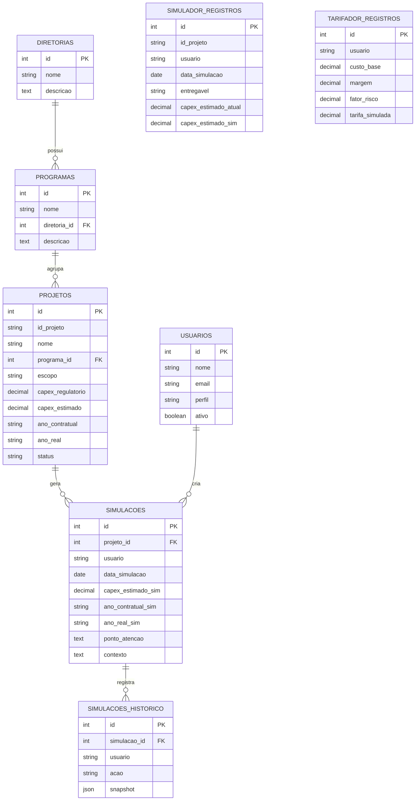

# 🗄️ Banco de Dados

Schema completo em [schema.sql](schema.sql) e massa de dados de demonstração em [seed_demo.sql](seed_demo.sql).

## Hierarquia de planejamento

```
Diretoria → Programa → Projeto → Escopo (atributo do projeto)
```

## Modelo de Entidade-Relacionamento (MER)



## Descrição das tabelas

| Tabela                   | Descrição                                                                                     |
| ------------------------ | ----------------------------------------------------------------------------------------------- |
| `usuarios`                | Usuários do portal e seu perfil de acesso (`adm` ou `usuario`)                                  |
| `diretorias`              | Nível 1 da hierarquia de planejamento (ex.: Malha Paulista, Engenharia)                          |
| `programas`               | Nível 2, agrupa projetos com o mesmo objetivo, vinculado a uma diretoria                          |
| `projetos`                | Nível 3, empreendimento específico dentro de um programa; base oficial somente leitura           |
| `simulacoes`              | Cenários hipotéticos criados pelo usuário a partir de um projeto, sem alterar a base oficial      |
| `simulacoes_historico`    | Rastreabilidade das ações (`criacao`, `edicao`, `exclusao`) feitas sobre uma simulação            |
| `simulador_registros`     | Registros operacionais do simulador, cadastrados manualmente ou importados via Excel              |
| `tarifador_registros`     | Modelo futuro (protótipo): base para o módulo de precificação/tarifas, ainda sem uso no fluxo atual de planejamento |
