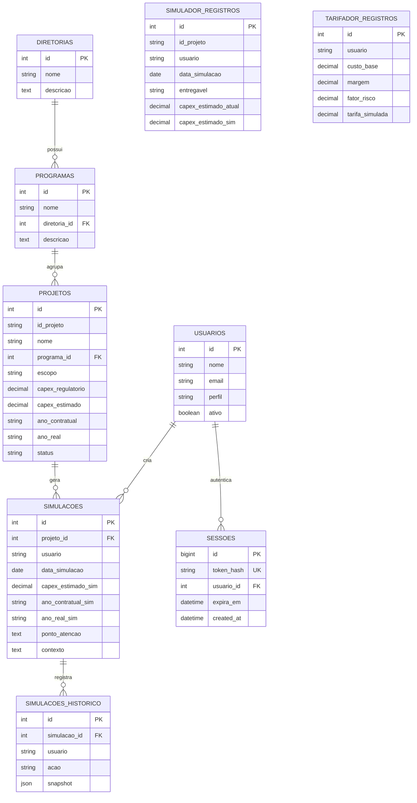

# 🗄️ Banco de Dados

Schema completo em [schema.sql](schema.sql) e massa de dados de demonstração em [seed_demo.sql](seed_demo.sql).

## Hierarquia de planejamento

```
Diretoria → Programa → Projeto → Escopo (atributo do projeto)
```

## Modelo de Entidade-Relacionamento (MER)


```mermaid
erDiagram
    DIRETORIAS ||--o{ PROGRAMAS : possui
    PROGRAMAS ||--o{ PROJETOS : agrupa
    PROJETOS ||--o{ SIMULACOES : gera
    SIMULACOES ||--o{ SIMULACOES_HISTORICO : registra
    USUARIOS ||--o{ SIMULACOES : cria
    USUARIOS ||--o{ SESSOES : autentica

    DIRETORIAS {
        int id PK
        string nome
        text descricao
    }
    PROGRAMAS {
        int id PK
        string nome
        int diretoria_id FK
        text descricao
    }
    PROJETOS {
        int id PK
        string id_projeto
        string nome
        int programa_id FK
        string escopo
        decimal capex_regulatorio
        decimal capex_estimado
        string ano_contratual
        string ano_real
        string status
    }
    SIMULACOES {
        int id PK
        int projeto_id FK
        string usuario
        date data_simulacao
        decimal capex_estimado_sim
        string ano_contratual_sim
        string ano_real_sim
        text ponto_atencao
        text contexto
    }
    SIMULACOES_HISTORICO {
        int id PK
        int simulacao_id FK
        string usuario
        string acao
        json snapshot
    }
    USUARIOS {
        int id PK
        string nome
        string email
        string perfil
        boolean ativo
    }
    SESSOES {
        bigint id PK
        string token_hash UK
        int usuario_id FK
        datetime expira_em
        datetime created_at
    }
    SIMULADOR_REGISTROS {
        int id PK
        string id_projeto
        string usuario
        date data_simulacao
        string entregavel
        decimal capex_estimado_atual
        decimal capex_estimado_sim
    }
    TARIFADOR_REGISTROS {
        int id PK
        string usuario
        decimal custo_base
        decimal margem
        decimal fator_risco
        decimal tarifa_simulada
    }
```

## Descrição das tabelas

| Tabela                   | Descrição                                                                                     |
| ------------------------ | ----------------------------------------------------------------------------------------------- |
| `usuarios`                | Usuários do portal e seu perfil de acesso (`adm` ou `usuario`)                                  |
| `sessoes`                 | Sessões de login; armazena o hash do token e sua expiração, vinculados ao usuário               |
| `diretorias`              | Nível 1 da hierarquia de planejamento (ex.: Malha Paulista, Engenharia)                          |
| `programas`               | Nível 2, agrupa projetos com o mesmo objetivo, vinculado a uma diretoria                          |
| `projetos`                | Nível 3, empreendimento específico dentro de um programa; base oficial somente leitura           |
| `simulacoes`              | Cenários hipotéticos criados pelo usuário a partir de um projeto, sem alterar a base oficial      |
| `simulacoes_historico`    | Rastreabilidade das ações (`criacao`, `edicao`, `exclusao`) feitas sobre uma simulação            |
| `simulador_registros`     | Registros operacionais do simulador, cadastrados manualmente ou importados via Excel              |
| `tarifador_registros`     | Modelo futuro (protótipo): base para o módulo de precificação/tarifas, ainda sem uso no fluxo atual de planejamento |

## Cadastro de projetos por planilha

Na tela administrativa de Cadastro, é possível baixar o modelo XLSX e importar vários projetos. Os campos obrigatórios são Diretoria, Programa, ID do Projeto e Nome do Projeto. As outras colunas do modelo são opcionais.

Diretorias e programas que ainda não existirem são criados durante a importação. O ID do projeto deve ser único na planilha e na tabela `projetos`. Todo o lote é validado antes da gravação e inserido em uma transação; se houver linha inválida ou código duplicado, nada do lote é gravado. Os projetos importados aparecem na Base de Projetos e podem ser editados individualmente na mesma tela de Cadastro.

O modelo é gerado por `GET /api/projetos/template`; o envio é feito a `POST /api/projetos/importar`, no campo multipart `arquivo`. Ambos exigem sessão administrativa. A importação cria linhas em `diretorias`, `programas` e `projetos`; não escreve em `simulador_registros`, que é usado para os registros operacionais de simulação.
